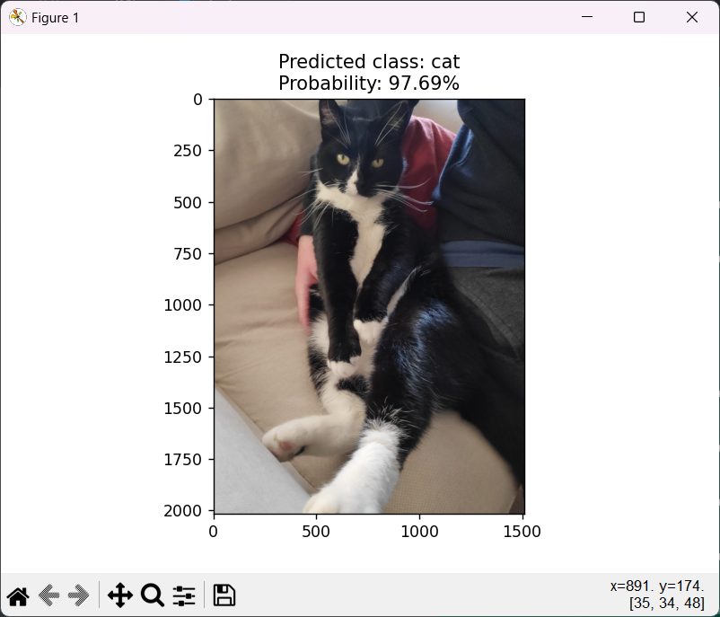
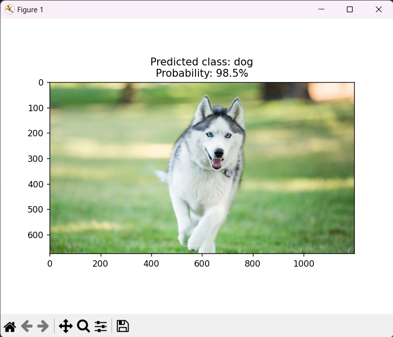
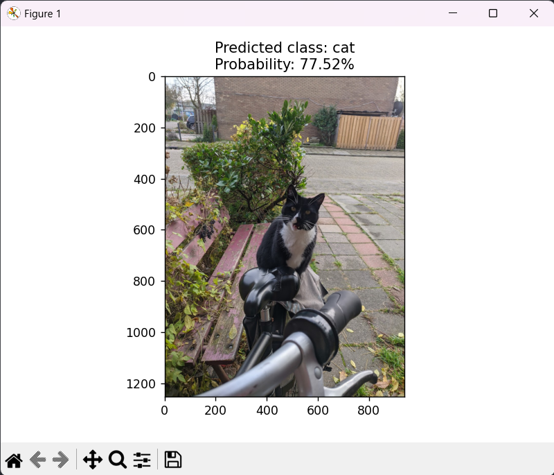

# cats_dogs
PyTorch Image Classification Model for Cat and Dog Pictures.

With this script a model can be trained and tested on the provided dataset using the PyTorch library. The script uses a pre-trained model from torchvision's models as a base and finetunes it on the provided dataset. 
The script allows for loading a trained model if one already exists, otherwise it will train a new model and save it for future use. After training or loading the model it's tested with the test data and prints the resulting accuracy. It also includes a function for testing with a single image file and displaying the results.

<h3>Example results</h3>

    <table>
	    <tr>
    	    <td style="padding:10px">
        	    
      	    </td>
            <td style="padding:10px">
            	
            </td>
            <td style="padding:10px">
            	
            </td>
        </tr>
    </table>

<h3>Data directory</h3>
The variable 'data_dir' specifies the location of the training and testing data. The dataset from https://www.kaggle.com/competitions/dogs-vs-cats can be used for training and testing.
In the data folder should be two folders: 'test' and 'train', each with two folders: 'cat' and 'dog' where the images are located.
